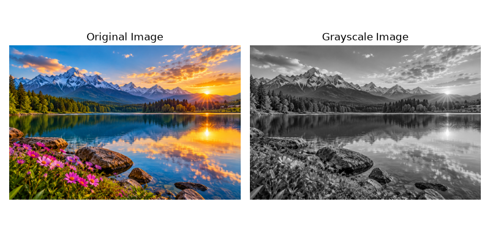
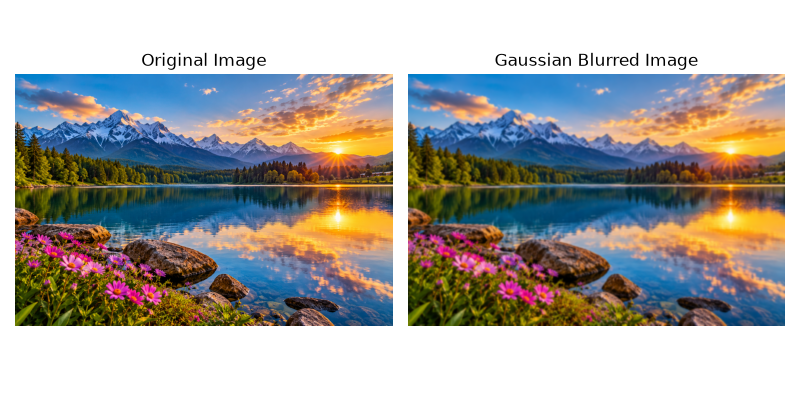
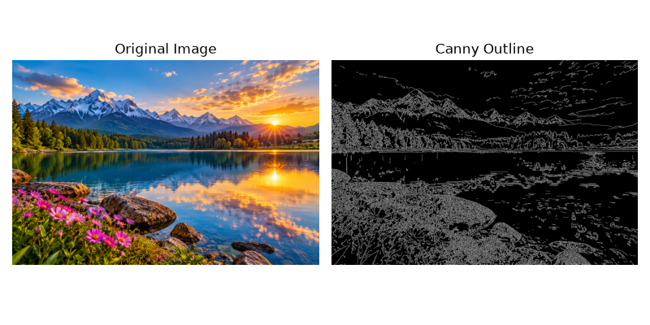
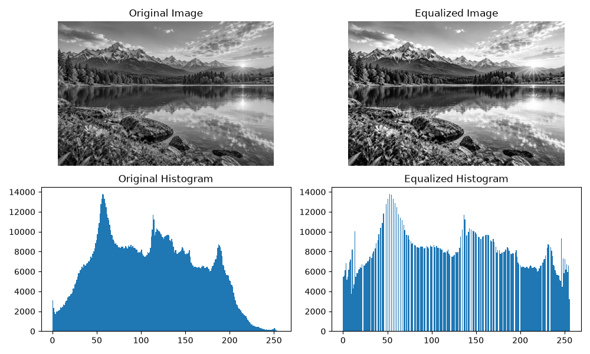
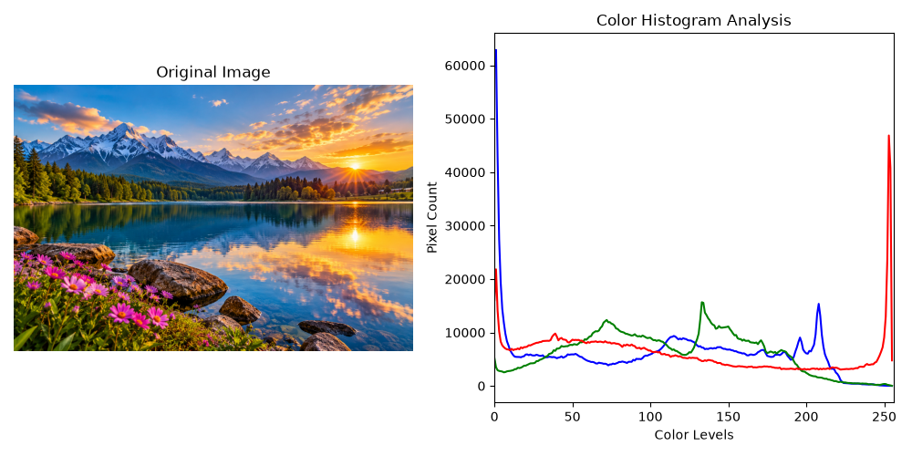
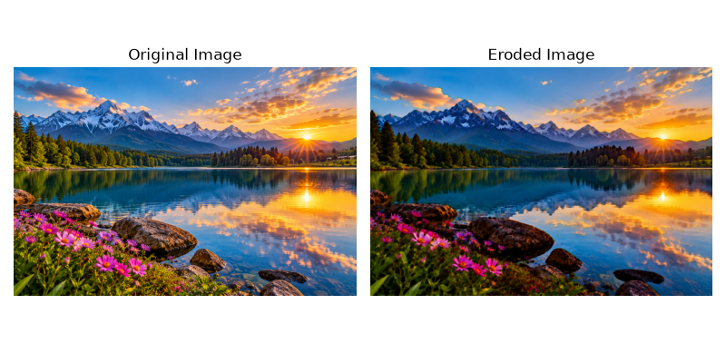
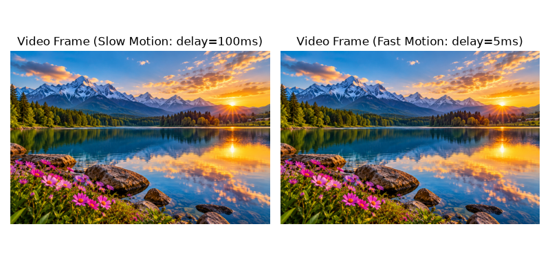
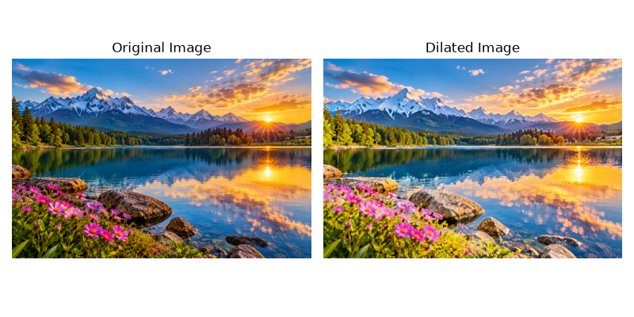
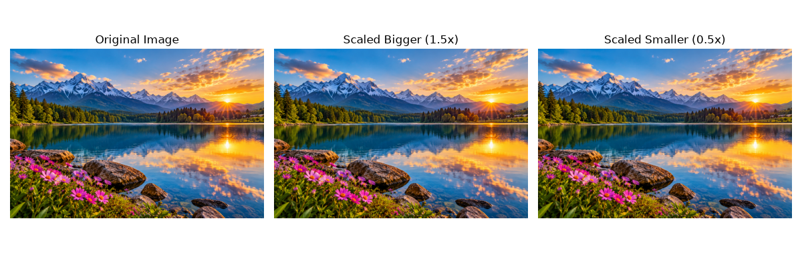
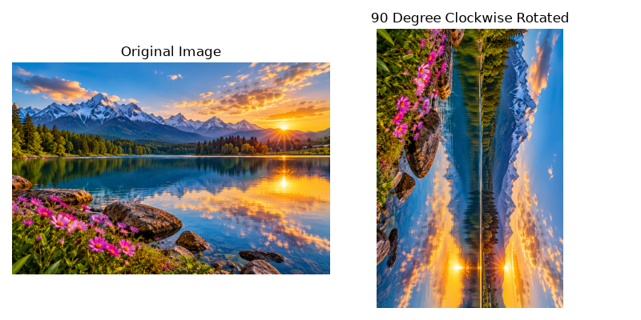

# Computer Vision Experiments

Practical implementations of fundamental computer vision techniques using Python and OpenCV.

## Experiments

### 1. Read Image and Convert to Grayscale
- **File**: `experiment1.py`
- **Output**:

---

### 2. Gaussian Blurring
- **File**: `experiment2.py`
- **Output**:

---

### 3. Canny Edge Detection (Outline)
- **File**: `experiment3.py`
- **Output**:

---

### 4. Histogram Equalization & Comparison
- **File**: `experiment4.py`
- **Output**:

---

### 5. Color Histogram Analysis
- **File**: `experiment5.py`
- **Output**:

---

### 6. Image Erosion
- **File**: `experiment6.py`
- **Output**:

---

### 7. Video Processing (Slow & Fast Motion)
- **File**: `experiment7.py`
- **Output**:

---

### 8. Image Dilation
- **File**: `experiment8.py`
- **Output**:

---

### 9. Image Scaling (Bigger and Smaller)
- **File**: `experiment9.py`
- **Output**:

---

### 10. 90-Degree Clockwise Rotation
- **File**: `experiment10.py`
- **Output**:

